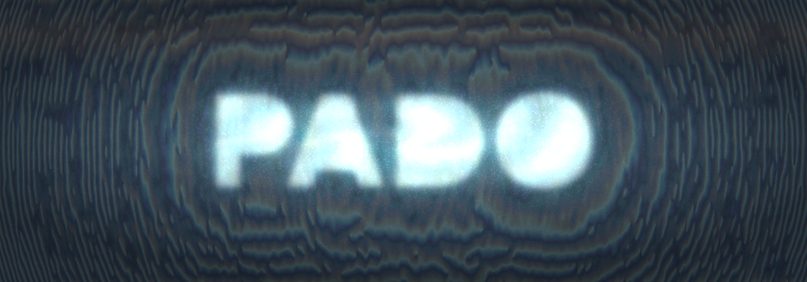

<div align="center">
  
</div>

<h1 align="center">PADO Hologram</h1>
<h3 align="center">An open-source computer-generated holography framework built on top of PADO</h3>

<p align="center">
  <a href="https://cinescope-wkr.github.io/pado-hologram/">Documentation</a> •
  <a href="#getting-started">Getting Started</a> •
  <a href="#architecture">Architecture</a> •
  <a href="#examples">Examples</a> •
  <a href="#contributing">Contributing</a> •
  <a href="#pado-hologram">PADO Hologram</a> •
  <a href="#pado-core-api">PADO Core API</a> •
  <a href="#repository-updates">Repository Updates</a> •
  <a href="#license">License</a>
</p>

---

## Overview

`PADO Hologram` is the CGH-focused evolution of the [`PADO`](https://github.com/shwbaek/pado)
differentiable optics core. Rebuilt as a lean, native stack, it picks up where
earlier frameworks such as [`holotorch`](https://github.com/facebookresearch/holotorch)
left off, with a stronger emphasis on long-term maintainability, clarity, and performance.

The underlying optics engine still lives in the `pado` package for compatibility,
but this repository should be understood as `PADO Hologram` in its current
maintained form.

The name draws from the Korean word [`파도`](https://ko.wikipedia.org/wiki/%ED%8C%8C%EB%8F%84), meaning `wave`.
It reflects both the physical waves we manipulate and the collective momentum of
the researchers who work on them.

We want this repository to be a unified home for differentiable holography:
a place where physicists, computer scientists, electrical engineers, optical engineers,
perception researchers, and curious builders can move beyond fragmented one-off
efforts and build together.

Let’s surf this [`파도`](https://ko.wikipedia.org/wiki/%ED%8C%8C%EB%8F%84) together.

---

## Fork Notice

> [!NOTE]
> This repository should be understood as a forked, repository-maintained,
> holography-oriented version of the original PADO project.
> The original PADO framework is developed by the [POSTECH Computer Graphics Lab](https://sites.google.com/view/shbaek/home).
>
> **Fork maintainer**: Jinwoo Lee  
> **Maintainer contact**: cinescope@kaist.ac.kr

## Naming Note

- Project and repository identity: `PADO Hologram`
- Core optics package kept for compatibility: `pado`
- Higher-level holography namespace reserved in this repository: `pado_hologram`
- `PADO` comes from the Korean word [`파도`](https://ko.wikipedia.org/wiki/%ED%8C%8C%EB%8F%84), meaning `wave`

## PADO Hologram

`PADO Hologram` is where we want the repository to grow:

- computer-generated holography workflows
- SLM-aware phase optimization
- device-oriented display encoding
- future setup orchestration and hardware-aware layers

This lets us keep `pado` as a compact optics core while clearly separating the
larger holography stack from the lower-level simulation primitives.

It also reflects a broader goal: not just a code release, but a place where the
field can gather around common abstractions, reusable tools, and a healthier
open research culture.

The first robust module set is already in place:

- `pado_hologram.config` for source and propagation specifications
- `pado_hologram.slm` for phase-only LCOS/SLM encoding
- `pado_hologram.targets` for reconstruction targets
- `pado_hologram.losses` for intensity/amplitude losses and metrics
- `pado_hologram.pipeline` for source -> SLM -> propagation -> evaluation orchestration
- `pado_hologram.algorithms` for compact hologram-generation algorithms such as Gerchberg-Saxton and DPAC
- `pado_hologram.experiment` and `pado_hologram.hydra_app` for Hydra-friendly experiment execution

## Architecture

The intended role split is:

- `PADO`: differentiable optics core for light fields, optical elements, propagation, materials, and numerical helpers
- `PADO Hologram`: CGH workflows, SLM/display abstractions, optimization utilities, and future experiment orchestration

The current starting point for that upper layer already exists in this repository:

- `pado.display` provides LCOS/SLM-oriented LUT encoding and phase-to-field conversion
- `pado_hologram` now exposes concrete modules for configs, device encoding, targets, losses, multi-plane orchestration, DPAC/GS algorithms, and Hydra-based experiment entry points
- the documentation now treats this direction as the main repository identity instead of a side note

## Repository Updates

> [!NOTE]
> The original PADO framework is developed and maintained by the [POSTECH Computer Graphics Lab](https://sites.google.com/view/shbaek/home).
> This forked repository state is maintained by Jinwoo Lee, and the items below
> should be described as fork-specific or repository-maintained contributions.

**Our contributions in this repository update**:

- Added `pado.display` for LCOS/SLM-oriented phase encoding workflows with `LCOSLUT`, `lcos_encode_phase`, and `slm_light_from_phase`.
- Added robust `pado_hologram` modules for configuration, SLM/device handling, targets, losses, single-plane and multi-plane pipelines, DPAC, and Gerchberg-Saxton optimization.
- Added a Hydra-friendly experiment layer and packaged config tree for reproducible holography runs.
- Stabilized core tensor-shape handling across `Light`, `OpticalElement`, `SLM`, and polarization-aware paths.
- Expanded regression tests to cover the new display module and recently fixed stability issues.
- Reframed the README and Sphinx documentation around the `PADO Hologram` repository identity.

**Stability fixes in this update**:

- Fixed `pad()` dimension bookkeeping so metadata stays aligned with the underlying tensor shape.
- Fixed complex-field resize and magnification paths used by `Light` and `OpticalElement`.
- Fixed LCOS phase wrapping so LUTs using `[0, 2π]` and `[-π, π]` conventions both encode target phase sanely.
- Fixed `Light.load_image(..., random_phase=True, batch_idx=...)` for single-batch random phase injection.
- Fixed `PolarizedLight.clone()`, `PolarizedLight.crop()`, and `PolarizedLight.magnify()`.
- Fixed `SLM.set_lens()` to work with the current wavelength-managed setter path.
- Fixed multi-channel `calculate_ssim()` support.
- Fixed `PolarizedSLM` so polarization-specific amplitude and phase state are tracked consistently.

## Getting Started

For this maintained repository state, the recommended path is to work from source:

```bash
git clone https://github.com/cinescope-wkr/pado-hologram.git
cd pado-hologram
pip install -e .
```

This repository keeps the core optics import path as `pado` and also exposes the
new holography-layer scaffold as `pado_hologram`:

```python
import pado
import pado_hologram
```

The first device-aware holography helper lives in `pado.display`:

```python
from pado.display import LCOSLUT, lcos_encode_phase, slm_light_from_phase
```

The higher-level holography layer now also provides configuration and orchestration
entry points:

```python
from pado_hologram import SourceSpec, PropagationSpec, HologramPipeline
```

For reproducible runs, the package also exposes a Hydra app:

```bash
python -m pado_hologram.hydra_app experiment=gs
python -m pado_hologram.hydra_app experiment=dpac target=gaussian
```

## PADO Core API

The `pado` package remains the core simulation API and currently provides:

- `pado.light`
- `pado.optical_element`
- `pado.propagator`
- `pado.material`
- `pado.math`
- `pado.display`

The API reference in the documentation should be read as the core foundation that
`PADO Hologram` is built on top of.

## Examples

This repository already contains strong CGH-oriented examples inside the original
PADO notebook set. The most relevant starting points for the hologram direction are:

- `example/2_Computer_Generated_Holography/2.1_DPAC.ipynb`
- `example/2_Computer_Generated_Holography/2.2_multi_depth_cgh.ipynb`
- `example/2_Computer_Generated_Holography/2.3_cgh_optimization_gs_sgd_adam.ipynb`
- `example/2_Computer_Generated_Holography/2.5_cgh_optimization_with_phase_only_slm.ipynb`
- `example/2_Computer_Generated_Holography/2.6_multi_depth_hologram_generation_using_adam_with_phase_only_slm.ipynb`

The broader optics examples remain valuable as the core layer beneath `PADO Hologram`.

The new `pado_hologram` package is intended to become the code-level counterpart
to these notebooks: a reusable orchestration layer rather than notebook-only logic.

## Contributing

Contributors are welcome.

If you have experience with related holography frameworks such as
[`holotorch`](https://github.com/facebookresearch/holotorch), your perspective is
especially valuable here. The goal is not to clone that project, but to learn from
what it enabled and rebuild the most useful workflow ideas in a smaller,
maintainable, PADO-native form.

More broadly, this project is intended as a meeting point for the holography and
computational imaging community across disciplines. Whether your background is
computer science, electrical engineering, optics, physics, psychology, perception science, or something adjacent,
you are welcome here if you care about this field and want to help it grow.

The long-term vision is to move past fragmented efforts and build something that
helps people collaborate, learn from one another, and inspire one another over time.

Good areas to help with:

- new hologram-generation algorithms and multi-plane methods
- SLM and display models, measured LUT support, and hardware-facing abstractions
- Hydra configs, experiments, tests, and documentation

See [CONTRIBUTING.md](./CONTRIBUTING.md) for the contributor-facing overview.

## Documentation

The documentation is now organized around the `PADO Hologram` repository identity
while still exposing the `pado` core API:

- landing page and architecture direction
- installation and package layout
- `PADO` core API reference
- notebook examples
- repository-maintained updates

## License

This repository remains under the MIT License. See [LICENSE](./LICENSE) for details.

## Citation

If you use this repository, cite the original PADO work as the core optics foundation.
If your work specifically depends on the maintained holography layer introduced in
this repository state, cite `PADO Hologram` as well.

```bib
@misc{Pado,
   Author = {Seung-Hwan Baek, Dong-Ha Shin, Yujin Jeon, Seung-Woo Yoon, Eunsue Choi, Gawoon Ban, Hyunmo Kang},
   Year = {2025},
   Note = {https://github.com/shwbaek/pado},
   Title = {Pado: Pytorch Automatic Differentiable Optics}
}
```

```bib
@software{lee2026padohologram,
   author = {Jinwoo Lee},
   title = {PADO Hologram: Holography Workflows Built on Top of PADO},
   year = {2026},
   note = {https://github.com/cinescope-wkr/pado-hologram},
   abstract = {Repository-maintained holography-oriented layer built on top of PADO, including DPAC, multi-plane workflows, and Hydra-based experiments}
}
```
