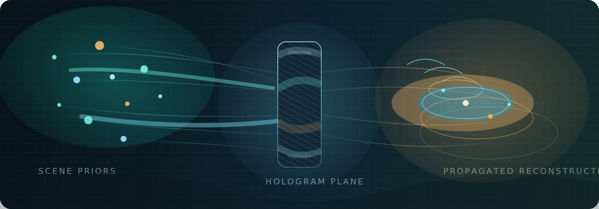

PADO Hologram
=============

Computer-generated holography workflows built on top of the original ``pado``
optics core.

``PADO`` also echoes the Korean word `파도 <https://ko.wikipedia.org/wiki/%ED%8C%8C%EB%8F%84>`_, meaning ``wave``. The project name
therefore points both to optical wave physics and to a more communal idea: that
this is a wave the community can ride together.

This repository is also intended as a shared home for the broader holography and
computational imaging community: a place where people from CS, EE, optics,
physics, psychology, perception research, and neighboring areas can build
together, learn from one another, and help move the field beyond fragmented
one-off efforts. In that spirit, ``PADO Hologram`` is an invitation to surf this
`파도 <https://ko.wikipedia.org/wiki/%ED%8C%8C%EB%8F%84>`_ together.

.. note::

   This documentation covers a forked, repository-maintained, holography-oriented
   repository built on top of the original PADO framework.
   The original framework is developed by the POSTECH Computer Graphics Lab.
   Fork maintainer: Jinwoo Lee (``cinescope@kaist.ac.kr``).

The repository identity is ``PADO Hologram``.
The core optics package path remains ``pado`` for compatibility.
The higher-level holography namespace reserved in this repository is ``pado_hologram``.

.. grid:: 1 1 2 5
   :gutter: 3
   :class-container: grid-container

   .. grid-item::
      :class: grid-item-card

      .. card::
         :link: pado_hologram
         :link-type: doc
         :class-card: custom-card

         PADO Hologram
         ^^^^^^^^^^^^^

         Architecture, scope, and repository direction for the holography layer.

   .. grid-item::
      :class: grid-item-card

      .. card::
         :link: installation
         :link-type: doc
         :class-card: custom-card

         Installation
         ^^^^^^^^^^^^

         Set up the maintained repository state and understand the package layout.

   .. grid-item::
      :class: grid-item-card

      .. card::
         :link: api/index
         :link-type: doc
         :class-card: custom-card

         PADO Core API
         ^^^^^^^^^^^^^

         Reference documentation for the ``pado`` optics core and current device helpers.

   .. grid-item::
      :class: grid-item-card

      .. card::
         :link: examples/index
         :link-type: doc
         :class-card: custom-card

         Examples
         ^^^^^^^^

         Holography-first notebooks plus the broader optics examples already in the repository.

   .. grid-item::
      :class: grid-item-card

      .. card::
         :link: updates
         :link-type: doc
         :class-card: custom-card

         Updates
         ^^^^^^^

         Repository-maintained additions and stabilization patches.

   .. grid-item::
      :class: grid-item-card

      .. card::
         :link: contributing
         :link-type: doc
         :class-card: custom-card

         Contributing
         ^^^^^^^^^^^^

         Welcome for contributors interested in building the holography layer.

   .. grid-item::
      :class: grid-item-card

      .. card::
         :link: license
         :link-type: doc
         :class-card: custom-card

         License
         ^^^^^^^

         Information about PADO's license and usage terms.

.. image:: ../images/footer_1.0.0.svg
   :width: 100%
   :class: footer-image

.. toctree::
   :hidden:
   :maxdepth: 2

   installation
   pado_hologram
   updates
   contributing
   api/index
   examples/index
   license
   citation

Indices and tables
==================

* :ref:`genindex`
* :ref:`modindex`
* :ref:`search`
* `Maintained PADO Hologram repository <https://github.com/cinescope-wkr/pado-hologram>`_
* `Original PADO GitHub repo <https://github.com/shwbaek/pado>`_
